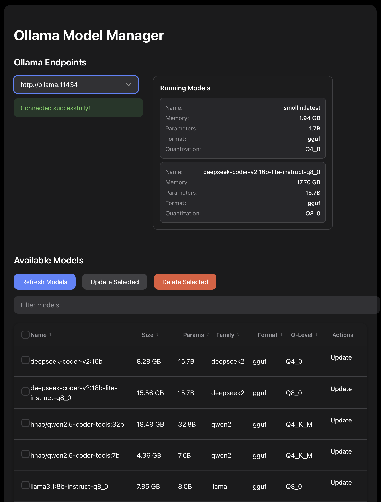

# Ollama Model Manager

A web-based management interface for Ollama endpoints, allowing you to manage and interact with multiple Ollama instances from a single dashboard.




## Features

- Connect to multiple Ollama endpoints simultaneously
- Web-based interface for model management
- Support for both local and remote Ollama instances
- Filter Models
- Sort Models\
- Select Multiple Models or All Models
- Delete Selected Models
- Light & Dark Theme (defaults dark)
- Update Models
- Running Models Stats
- Pull Models from Ollama Hub
- Swagger API Documentation
- Installable as a PWA (offline app shell; live data always fetched fresh)
- [Unraid Deployment Guide (untested)](https://github.com/d3v0ps-cloud/OllamaModelManager/blob/main/docs/unraid.md)

## Prerequisites

- Node.js 20.x or later (for npm installation)
- Docker and Docker Compose (for Docker installation)
- One or more running Ollama instances

## Installation

### Using npm

1. Clone the repository:
```bash
git clone https://github.com/d3v0ps-cloud/OllamaModelManager.git
```

```bash
cd OllamaModelManager
```

2. Install dependencies:
```bash
npm install
```

3. Create a `.env` file in the root directory and configure your Ollama endpoints:
```bash
OLLAMA_ENDPOINTS=http://localhost:11434,https://ollama1.remote.net,https://ollama2.remote.net
```

4. Start the application:

Development mode (with hot reload):
```bash
npm run dev
```

Production mode (runs in the background via PM2):
```bash
npm start
```

The application will be available at `http://localhost:3000`

### Managing the background process

| Command | Description |
|---|---|
| `npm start` | Start in background |
| `npm stop` | Stop the process |
| `npm restart` | Restart the process |
| `npm run kill` | Stop and remove from PM2 |
| `npm run status` | Show process status |
| `npm run logs` | Tail logs |

To auto-start on system boot:
```bash
npx pm2 startup
npx pm2 save
```

### Using Docker

#### Option 1 - Build your own image

1. Clone the repository:
```bash
git clone https://github.com/d3v0ps-cloud/OllamaModelManager.git
```

```bash
cd OllamaModelManager
```

2. Configure your Ollama endpoints in `docker-compose.yml`:
```yaml
environment:
  - OLLAMA_ENDPOINTS=http://your-ollama-ip:11434,https://ollama1.remote.net
```

3. Build and start the container:
```bash
docker compose up -d
```

The application will be available at `http://localhost:3000`

#### Option 2 - Use the prebuilt image

1. Copy down the Pre-Built Compose file:
```bash
docker-compose-prebuilt.yml
```

2. Configure your Ollama endpoints in `docker-compose-prebuilt.yml`:
```yaml
environment:
  - OLLAMA_ENDPOINTS=http://your-ollama-ip:11434,https://ollama1.remote.net
```

3. Build and start the container:
```bash
docker compose up -d
```

The application will be available at `http://localhost:3000`

## Configuration

### Environment Variables

- `OLLAMA_ENDPOINTS`: Comma-separated list of Ollama API endpoints (required)
  - Format: `http://host1:port,http://host2:port`
  - Example: `http://192.168.1.10:11434,https://ollama1.remote.net`
- `PORT`: Port to listen on (default `3000`).
- `HOST`: Interface to bind (default `0.0.0.0`, i.e. all interfaces). Leave as the
  default when fronting the app with a reverse proxy.

## Running behind a reverse proxy (custom domain / HTTPS)

The app is reverse-proxy ready, so you can serve it at a custom domain with no
port in the URL (e.g. `https://ollama.example.com`) behind any TLS-terminating
reverse proxy (Caddy, nginx, Traefik, …):

- It sets `trust proxy`, so it honours `X-Forwarded-Proto`/`-Host` from the proxy.
- Client requests use **relative** URLs, so it works under any hostname, not just
  `localhost`.
- It binds all interfaces by default (`HOST=0.0.0.0`) so the proxy can reach it;
  point the proxy's `reverse_proxy` / `proxy_pass` target at the app's `HOST:PORT`
  (default `:3000`).

Then add a DNS record for your chosen hostname and a vhost in your proxy that
terminates TLS and forwards to the app. Example (Caddy):

```caddyfile
ollama.example.com {
    reverse_proxy <app-host>:3000
}
```

> To install the app as a PWA later, the origin must use a **browser-trusted**
> certificate (e.g. Let's Encrypt) — a self-signed / internal-CA cert will block
> service-worker registration.

## Install as an app (PWA)

The app ships a web manifest and a service worker, so it can be installed and run
in its own window.

- On `http://localhost:3000` (a secure context), open the app and use the
  browser's **Install** action (Chrome/Brave: the install icon in the address
  bar; Android: "Add to Home screen").
- The service worker caches the **app shell** (HTML/CSS/icons) for offline launch,
  but **always fetches live Ollama data from the network** — model lists and chat
  are never served stale from cache.
- Installing over a custom domain requires a **browser-trusted HTTPS** certificate
  (see the note above); a self-signed / internal-CA cert blocks installation.

## Development

Run with hot reload (nodemon):

```bash
npm run dev
```

